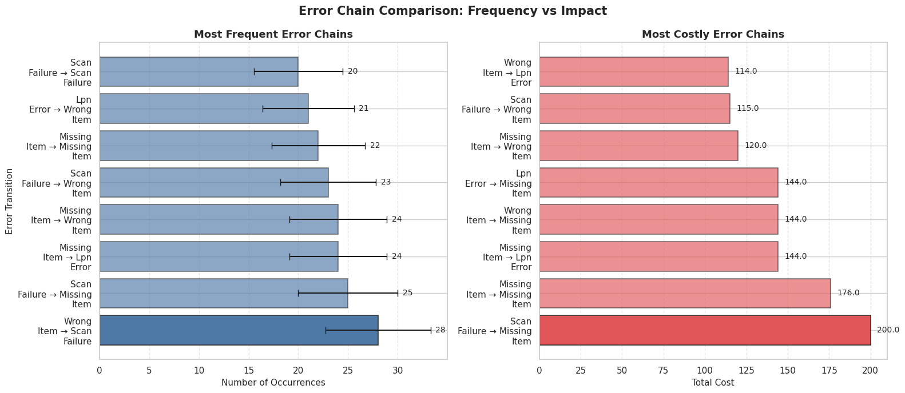

# Warehouse Error Analysis: Identifying High-Impact Failures and Propagation Patterns

*A data analysis and machine learning project focused on identifying high-impact warehouse failures and supporting data-driven operational decision-making.*

## Overview

This project analyzes warehouse operational errors to identify high-impact failure points, understand how errors propagate across workflows, and support data-driven operational improvements.

The analysis combines error frequency, time impact, process distribution, and error propagation patterns to prioritize interventions that reduce inefficiency and prevent downstream failures.

## Project Preview

---

## Business Problem

Warehouse operations depend on speed, accuracy, and process consistency. When errors occur, they create hidden costs through rework, delays, and workflow disruptions that impact both efficiency and customer satisfaction.

A key challenge is that errors are often treated as isolated events, making it difficult to identify:
- Where failures concentrate  
- Which issues generate the greatest operational cost  
- How problems propagate across the workflow  

Without this visibility, improvement efforts may focus on the most visible errors rather than the ones that drive the highest overall impact.

---

## Key Insights

- Missing Item errors are the primary driver of total operational time loss  
- The picking process is the highest-risk stage for critical failures  
- Errors propagate through the workflow, forming recurring failure chains  
- High-frequency errors are not always the most costly  
- Error patterns show partial predictability using workflow context  

---

## Approach

The analysis was structured in four stages:

1. **Descriptive Analysis**  
   - Error frequency and distribution  
   - Process-level error concentration  

2. **Impact Analysis**  
   - Operational time loss by error type  
   - Identification of high-cost failure points  

3. **Error Propagation Analysis**  
   - Error chain detection  
   - Transition probability matrix  
   - Sankey visualization of failure flows  

4. **Predictive Modeling**  
   - Random Forest classification model  
   - Evaluation of error predictability using workflow context  

---

## Key Visualizations

- Error frequency distribution  
- Errors by process step (stacked bar + heatmap)  
- Operational time loss comparison  
- Error transition matrix (heatmap)  
- Sankey diagram of error propagation  
- Frequency vs impact comparison of error chains  

---

## Business Impact

This analysis demonstrates how warehouse operations can move from reactive error handling to proactive, data-driven decision-making.

By prioritizing high-impact errors and breaking propagation chains, organizations can:
- Reduce total operational time loss  
- Improve process reliability  
- Prevent cascading failures  
- Allocate resources more effectively  

---

## Predictive Insight

A classification model achieved moderate accuracy (~53%), indicating that operational errors show partial predictability based on workflow context.

This suggests that predictive approaches could support:
- Risk-based monitoring  
- Early detection of high-risk scenarios  
- More proactive operational interventions  

---

## Operational Recommendations

- Prioritize high-impact errors, especially Missing Item  
- Strengthen controls in the picking process  
- Address upstream root causes to prevent error propagation  
- Implement risk-based monitoring using workflow signals  
- Focus improvements on impact, not frequency alone  

---

## Operational Considerations

Real-world warehouse environments introduce additional sources of error not captured in the dataset.

System-related issues such as scanner disconnections, latency, and software integration mismatches can lead to data inconsistencies, ghost inventory, and locked orders.

Additionally, manual processes increase variability due to human factors, while highly automated systems shift risk toward technology reliability and maintenance.

These factors highlight the importance of combining data analysis with operational context when designing improvements.

---

## Tools & Technologies

- Python (Pandas, NumPy)  
- Data Visualization (Matplotlib, Seaborn, Plotly)  
- Machine Learning (Scikit-learn)  

---

## Project Structure
warehouse_operational_error_analysis.ipynb  # Full analysis
README.md                                  # Project summary
data/                                      # (Optional) dataset or synthetic data
notebooks/                                 # (Optional) development notebooks

---

## How to Run This Project

1. Clone the repository:
git clone https://github.com/aesquivel94/operational-error-analyzer.git

2. Install dependencies:
pip install pandas numpy matplotlib seaborn plotly scikit-learn

3. Open the notebook:
jupyter notebook warehouse_operational_error_analysis.ipynb

---

---

## Notes

This project uses synthetic data designed to simulate realistic warehouse operations.

## Author

Alejandra Esquivel  
Data Analyst | Data Specialist | Statistician  

